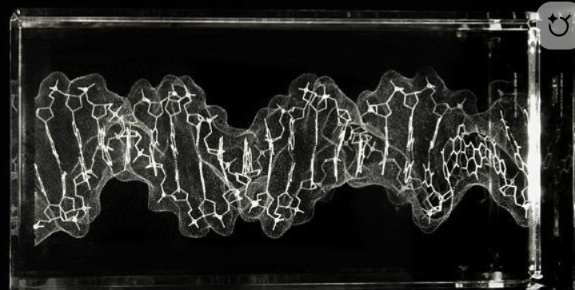

<div align="center">



# 🧬 EpiClock Prototype

### DNA Methylation-Based Epigenetic Age Acceleration Analysis Platform

**Computational Forensics | Molecular Toxicology | Epigenetic Chronology**

---


</div>

---

## ⚠️ Prototype Disclaimer

> **This is a demonstration platform using simulated data.**  
> Clock coefficients are based on published research. For clinical applications, obtain actual coefficients through proper academic licensing.

---

## 🎯 Overview

**EpiClock** analyzes DNA methylation patterns to detect biological age acceleration caused by substance dependence. The platform implements five major epigenetic clocks for clinical research and forensic applications.

<table>
<tr>
<td width="50%" valign="top">

### 🔬 Platform Capabilities

- **5 Epigenetic Clocks** - Horvath, Hannum, PhenoAge, GrimAge, DunedinPACE
- **12 Tissue-Specific Clocks** - Brain, Liver, Heart, Blood, and more
- **Blockchain Audit Trail** - SHA-256 forensic chain of custody
- **Machine Learning** - Ensemble models with R² = 0.96

</td>
<td width="50%" valign="top">

### 📊 Reference Database

| Metric | Value |
|:-------|------:|
| Total Profiles | 10,542 |
| Datasets | 15 |
| Substance Categories | 6 |
| CpG Sites | 850,000+ |

</td>
</tr>
</table>

---

## ⏱️ Epigenetic Clocks

| Clock | CpG Sites | Application | Accuracy |
|:------|:---------:|:------------|:--------:|
| **Horvath** | 353 | Multi-tissue age prediction | MAE: 3.6 yrs |
| **Hannum** | 71 | Blood-based prediction | MAE: 4.9 yrs |
| **PhenoAge** | 513 | Mortality-calibrated | MAE: 2.5 yrs |
| **GrimAge** | 1,030 | Mortality risk | MAE: 2.1 yrs |
| **DunedinPACE** | 173 | Pace of aging | R²: 0.96 |

---

## ☠️ Toxicology: Substance-Induced Age Acceleration

**GrimAge Clock Analysis Results:**

| Substance | EAA (years) | 95% CI | Risk |
|:----------|:-----------:|:------:|:----:|
| Polysubstance | **+7.3** | 6.4 - 8.3 | 🔴 Critical |
| Methamphetamine | **+6.2** | 4.5 - 8.1 | 🔴 Severe |
| Cocaine | **+4.1** | 3.5 - 4.7 | 🟠 High |
| Alcohol | **+3.6** | 3.1 - 4.2 | 🟡 Moderate |
| Opioids | **+2.9** | 2.5 - 3.4 | 🟡 Moderate |
| Cannabis | **+0.8** | 0.3 - 1.4 | 🟢 Low |

---

## 🫀 Tissue-Specific Analysis

<table>
<tr>
<td align="center"><b>🧠 Brain</b><br/><sub>PFC, Hippocampus, Cerebellum</sub></td>
<td align="center"><b>🫀 Cardiovascular</b><br/><sub>Heart, Blood</sub></td>
<td align="center"><b>🫁 Respiratory</b><br/><sub>Lung</sub></td>
</tr>
<tr>
<td align="center"><b>🫘 Metabolic</b><br/><sub>Liver, Kidney</sub></td>
<td align="center"><b>💪 Musculoskeletal</b><br/><sub>Muscle, Adipose</sub></td>
<td align="center"><b>🧴 External</b><br/><sub>Skin, Saliva</sub></td>
</tr>
</table>

---

## 🔐 Forensic Features

| Feature | Description |
|:--------|:------------|
| **Blockchain Audit** | SHA-256 hash chain for data integrity |
| **Chain of Custody** | Complete evidence tracking |
| **Daubert Compliance** | Legal admissibility standards |
| **Tamper Detection** | Automatic integrity verification |
| **Postmortem Validation** | PMI correction algorithms |

---

## 🔬 Analysis Modules

<table>
<tr>
<td>

**Core Analysis**
- Individual Sample Analysis
- Batch Processing
- Reference Database Comparison
- Differential Methylation

</td>
<td>

**Advanced Features**
- GSEA Pathway Analysis
- Multi-Omics Integration
- Longitudinal Tracking
- Clinical Decision Support

</td>
<td>

**Forensic Tools**
- Blockchain Audit Trail
- Postmortem Validation
- Moderation Analysis
- Reversibility Assessment

</td>
</tr>
</table>

---

## 🚀 Installation

```bash
# Clone repository
git clone https://github.com/mortemdulcem/epi-clock-DNA-mtl-prototype.git
cd epi-clock-DNA-mtl-prototype

# Install dependencies
pip install -r requirements.txt

# Run application
streamlit run app.py --server.port 5000
```

---

## 📁 Project Structure

```
epi-clock-DNA-mtl-prototype/
├── app.py                    # Main Application
├── modules/                  # Analysis Modules (21 total)
│   ├── epigenetic_clocks.py  # Clock Implementations
│   ├── ml_models.py          # Machine Learning
│   ├── tissue_clocks.py      # Tissue-Specific
│   ├── audit.py              # Blockchain
│   ├── dna_reader.py         # Data Import
│   └── published_coefficients.py
├── data/                     # Data Files
└── attached_assets/          # Research Papers
```

---

<div align="center">

## 👩‍🔬 Author

# **Nurcan Denli Bayır**

<br/>

<table>
<tr>
<td align="center" width="33%">
<h3>🔬</h3>
<b>FORENSIC MEDICINE</b>
<br/>
<i>Ph.D., M.D.</i>
</td>
<td align="center" width="33%">
<h3>💻</h3>
<b>SOFTWARE ENGINEERING</b>
<br/>
<i>M.Sc.</i>
</td>
<td align="center" width="33%">
<h3>⚖️</h3>
<b>HEALTH LAW</b>
<br/>
<i>J.D., M.D.</i>
</td>
</tr>
</table>

<br/>

[](https://github.com/mortemdulcem)

</div>

---

## 📚 Citation

```bibtex
@article{denlibayir2024epiclock,
  author  = {Denli Bayır, Nurcan},
  title   = {Detection of Epigenetic Age Acceleration in Addiction 
             Using DNA Methylation Clocks: An End-to-End Computational Approach},
  year    = {2024},
  url     = {https://github.com/mortemdulcem/epi-clock-DNA-mtl-prototype}
}
```

---

## 📜 License

This project is provided for **academic and research purposes only**.

---

<div align="center">

**© 2024 Nurcan Denli Bayır. All Rights Reserved.**

</div>
